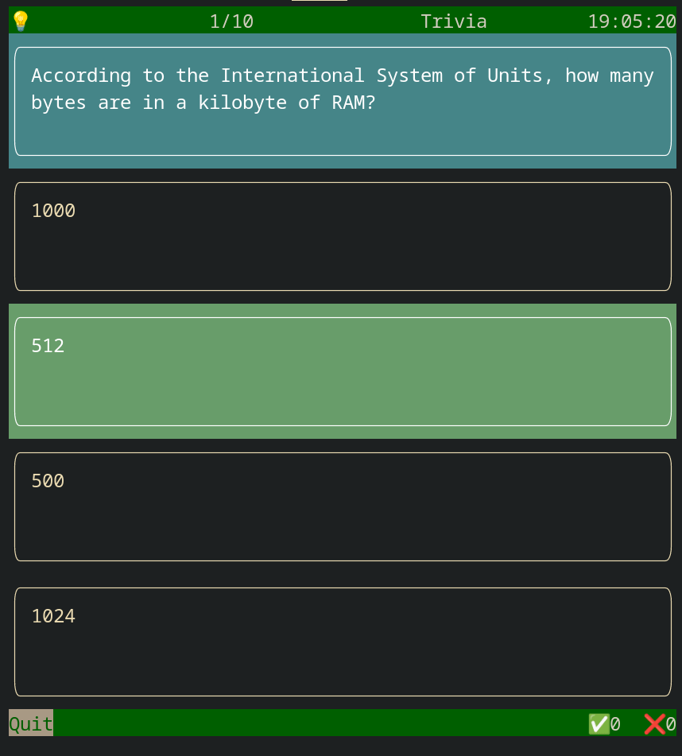

# trivia

[](https://codecov.io/gh/rochacbruno/trivia)
[](https://github.com/rochacbruno/trivia/actions/workflows/main.yml)

Python client for Open trivia Database

## Install it from PyPI

```bash
pip install trivia
```

## Usage

```bash
trivia
# or
python -m trivia
```

You can pass arguments `[amount], [category], [level]`

```bash
# 15 questions, from category 18, level easy
trivia 15 18 easy
```



## Development

Read the [CONTRIBUTING.md](CONTRIBUTING.md) file.
